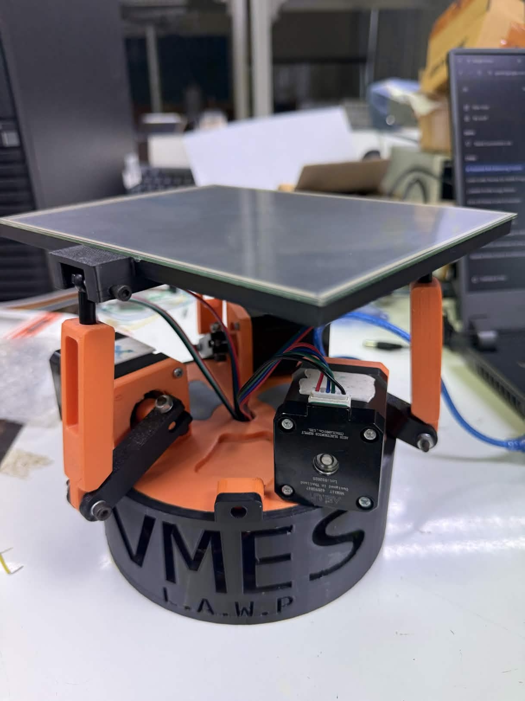
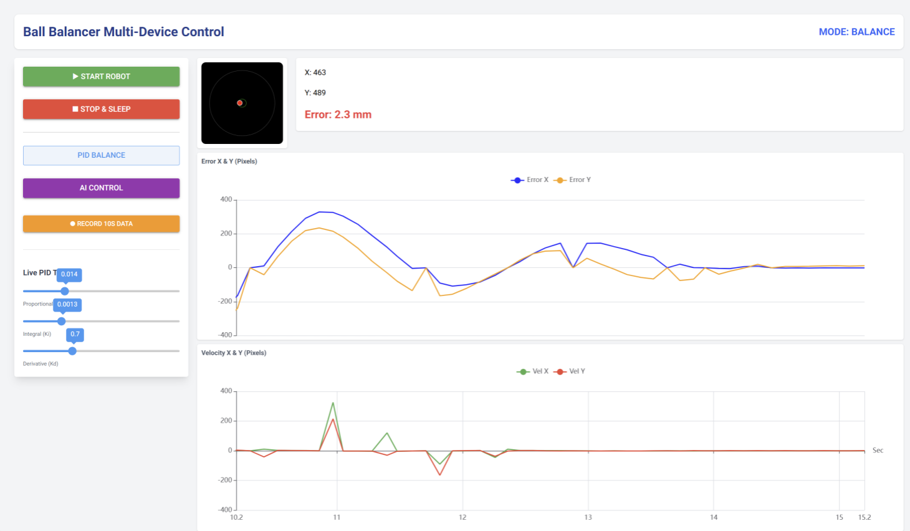

# 3-RRS Ball Balancing System

## Project Overview
This project involved designing an advanced AI-driven control architecture for a 3-RRS (Revolute-Revolute-Spherical) parallel manipulator. The core objective was to continuously stabilize and balance a ball on a dynamic platform. 

This system serves as a powerful demonstration of transitioning from classical control theory to modern machine learning techniques in a complex electromechanical environment.

## Implementation Details
To manage the system, an **expert policy** was initially established by developing and meticulously tuning a **PID controller** to handle the complex balancing task. 

To achieve autonomous AI control, an **Imitation Learning** architecture was implemented. A **Support Vector Regression (SVR) model** utilizing a **Radial Basis Function (RBF) kernel** was trained on the data generated by the PID controller. 

*(Watch the system in action below)*
<video src="Ball_balancing_Video.mp4" width="800" controls></video>

---
*Note: The full project documentation are kept private, but are available for review upon request.*
