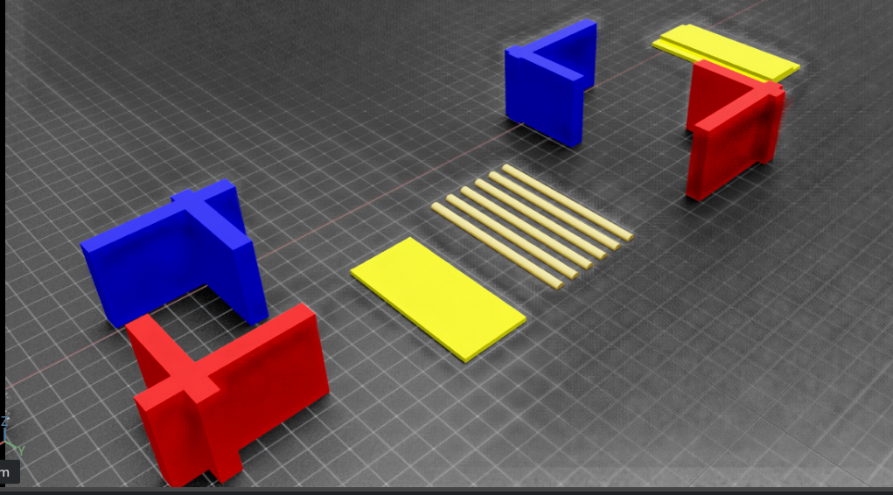
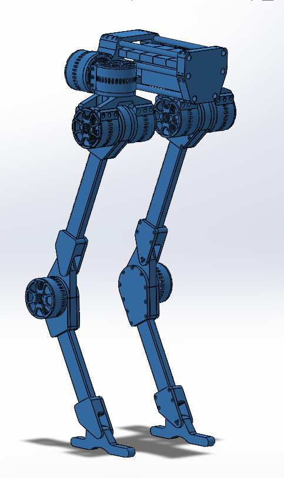
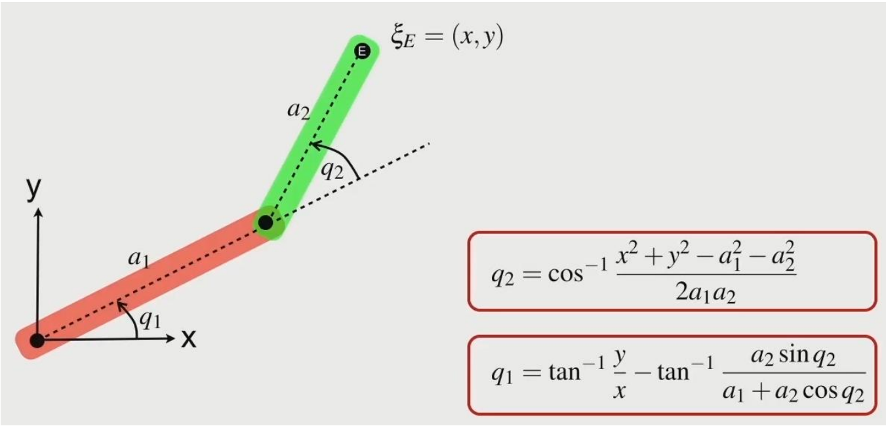
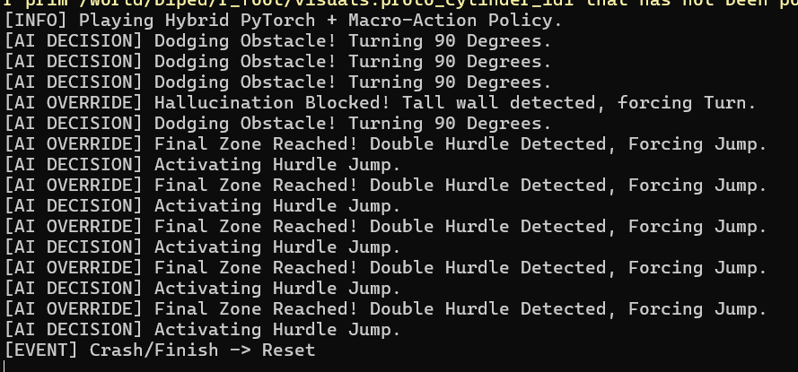

# Bipedal Robot Controller (NVIDIA Isaac Sim)

## Project Overview
This project focused on achieving stable, continuous locomotion for a custom-designed bipedal robot. The core challenge was developing a robust control system capable of maintaining dynamic balance while navigating complex environments. This project bridges the gap between traditional state-based control and deep reinforcement learning by utilizing an imitation learning architecture.

  *The custom simulation environment built in NVIDIA Isaac Sim, featuring various terrain challenges and obstacles to test the robot's locomotion robustness.*

## Implementation Details

### Mechanical Design & Kinematics
The project began with the physical architecture of the bipedal legs, designed with specific degrees of freedom to mimic natural articulation using high-torque actuators. 

  *CAD assembly of the bipedal leg structure showcasing the actuator placement and joint configuration.*

To control the precise placement of the robot's feet during the walking cycle, **Inverse Kinematics (IK)** was utilized. By applying geometric IK formulas, the system calculates the exact required joint angles based on the desired Cartesian coordinates of the foot trajectories.

  *Inverse Kinematics geometric derivation used for joint angle calculations. (Source: [Robot Academy](https://robotacademy.net.au/lesson/inverse-kinematics-for-a-2-joint-robot-arm-using-geometry/))*

### Control Architecture & Imitation Learning
The physical simulation and testing environment was executed using **NVIDIA Isaac Sim**. 

To establish a baseline for successful walking mechanics, a **Finite State Machine (FSM)** was developed to act as the expert behavioral policy. The FSM orchestrates the gait phases (swing and stance) utilizing the IK calculations to ensure stable, rhythmic foot placement.

Building upon this expert policy, an advanced **Imitation Learning** pipeline was engineered. A **Fitted Q-Iteration (FQI) Deep Neural Network** was trained using the state-action data generated by the FSM. This approach allowed the neural network to learn and replicate the complex, non-linear control strategies required for stable bipedal locomotion, effectively cloning the expert walking policy into an autonomous AI model.

Results:

*(Watch the simulation in action below)*

<video src="Bipedal_robot_controller.mp4" width="800" controls></video>

---

*Note: The full source code for the simulation environment and control architecture is kept private, but is available for review upon request.*
