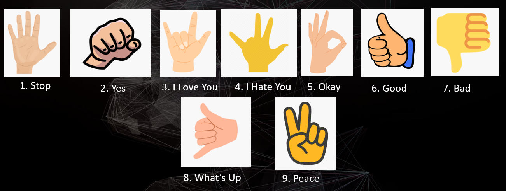
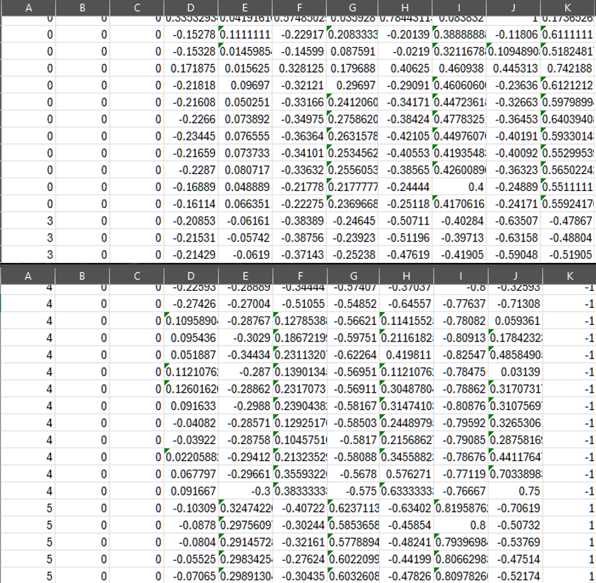
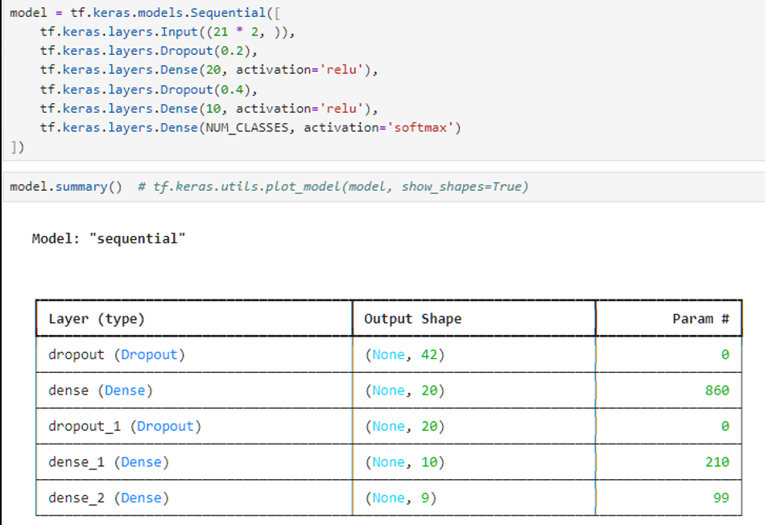
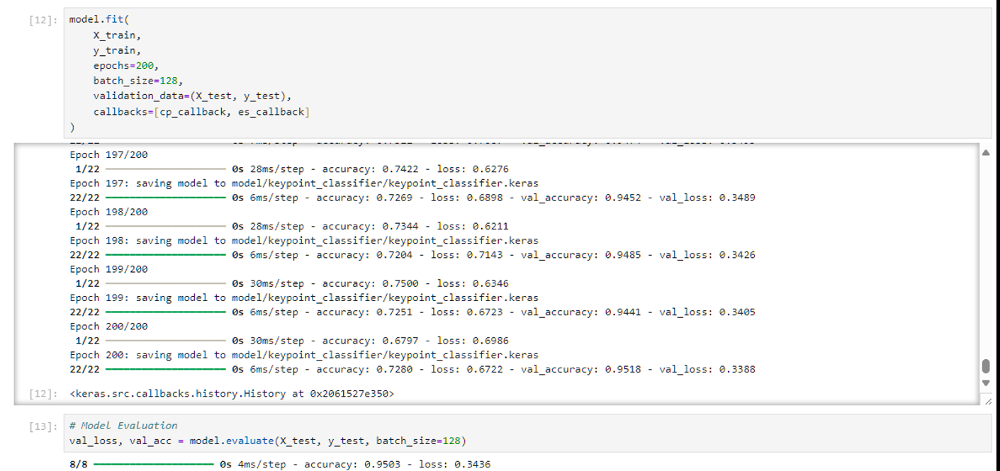

[Lalita Shanmugam](/)

# Custom Hand Sign Recognition using Computer Vision and Development

## Project Overview

This project focuses on building a real-time hand gesture recognition system that classifies custom hand signs and converts them into spoken words using text-to-speech (TTS). 

## Methodology & Dataset

To capture hand movements, **MediaPipe's Hand Tracking module** was utilized to detect and extract 21 precise hand landmarks in real-time. 

- **Data Collection:** Images of custom hand signs were captured, and the corresponding landmark coordinates were recorded.
- **Preprocessing:** The landmark data was centered, normalized, and flattened into a structured dataset.
- **Dataset Structure:** Stored with 43 columns (1 index column representing the hand sign category and 42 coordinate columns for the 21 landmarks $\times$ 2 axes).

## Model Architecture

A deep learning classifier was built using a **TensorFlow/Keras Sequential model** to process the flattened landmark coordinates and output the correct hand sign class.

- **Input Layer:** 42 features (21 landmarks $\times$ 2 coordinates)
- **Hidden Layers:** Dense layers with ReLU activation, integrated with Dropout layers (0.2 and 0.4) to prevent overfitting.
- **Output Layer:** Softmax activation with 9 output classes corresponding to the distinct hand signs.

## Model Training & Evaluation

The model was trained over 200 epochs with a batch size of 128, utilizing ModelCheckpoint and EarlyStopping callbacks. It achieved a robust final evaluation accuracy of **~95.03%**.

## Challenges & Future Improvements

- **Misclassification:** Similar static hand signs (such as "Good" vs. "What’s Up") occasionally face confusion.
- **Environmental Sensitivity:** Variations in lighting and background conditions can impact MediaPipe's tracking performance.
- **Future Scope:** Transitioning to sequence-based recognition (e.g., LSTMs) to support dynamic, time-series gesture tracking.

## System in Action

*(Watch the system demo below)*

<video src="hand-sign-demo.mp4" controls="controls" style="max-width: 100%;"></video>

 

*Note: The full project code and documentation are kept private, but are available for review upon request.*
