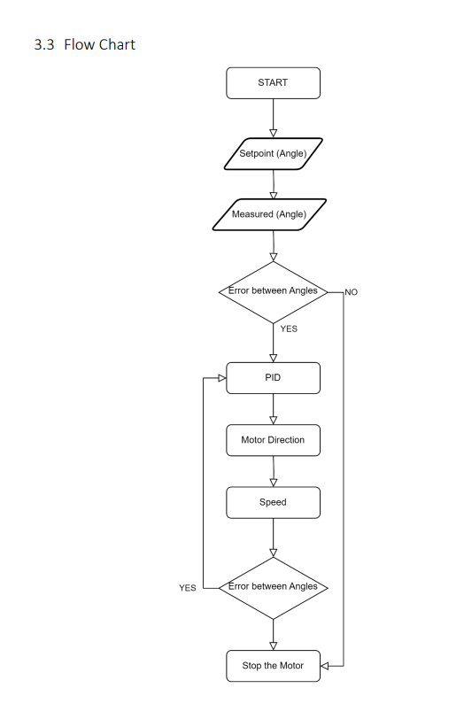

# IoT-Enabled Two-Wheeled Robot

## Project Overview
This project involved the design and implementation of an IoT-enabled, two-wheeled robotic system focused on precise position control. Developed as part of an engineering team, the project demonstrates the integration of complex control theory (Dual PID), hardware-in-the-loop simulation, and real-time wireless communication. 

## Implementation Details

### Hardware Architecture
The system's hardware architecture leverages a dual-microcontroller setup to maximize efficiency:
* **STM32F4:** Acts as the primary control unit, processing real-time feedback from incremental encoders and managing the precise PWM outputs for the motor drivers.
* **ESP32:** Acts as the dedicated IoT communication node, handling the wireless data stream without interrupting the STM32's control loop.

### Control Systems & Simulink Modeling
The core control logic was mathematically modeled and generated using **Simulink** with the Waijung Blockset. A **Dual PID Controller** was implemented to independently manage the position of each wheel. By converting encoder pulses into angle measurements, the PID controllers dynamically minimize the error between the actual wheel position and the desired setpoint. Through meticulous tuning, the system achieved highly stable position tracking with an error deviation of only 0-3 degrees.

  *Flow chart detailing the continuous PID control loop logic, from evaluating the setpoint against measured angles to dynamically adjusting motor speed and direction.*

### IoT Integration (Blynk)
To enable remote operation, the system is integrated with the **Blynk** IoT platform. The ESP32 receives user commands from a mobile interface and transmits them via UART to the STM32. This allows the user to dynamically adjust motor setpoints (angles and speed) and monitor real-time telemetry from the robot seamlessly.

## Hardware Demonstration

*(Watch the real-time IoT control system in action below)*

<video src="IoT_TwoWheeled.mov" width="350" controls></video>

---
*Note: The Simulink models, STM32/ESP32 firmware, and full project documentation are kept private, but are available for review upon request.*
