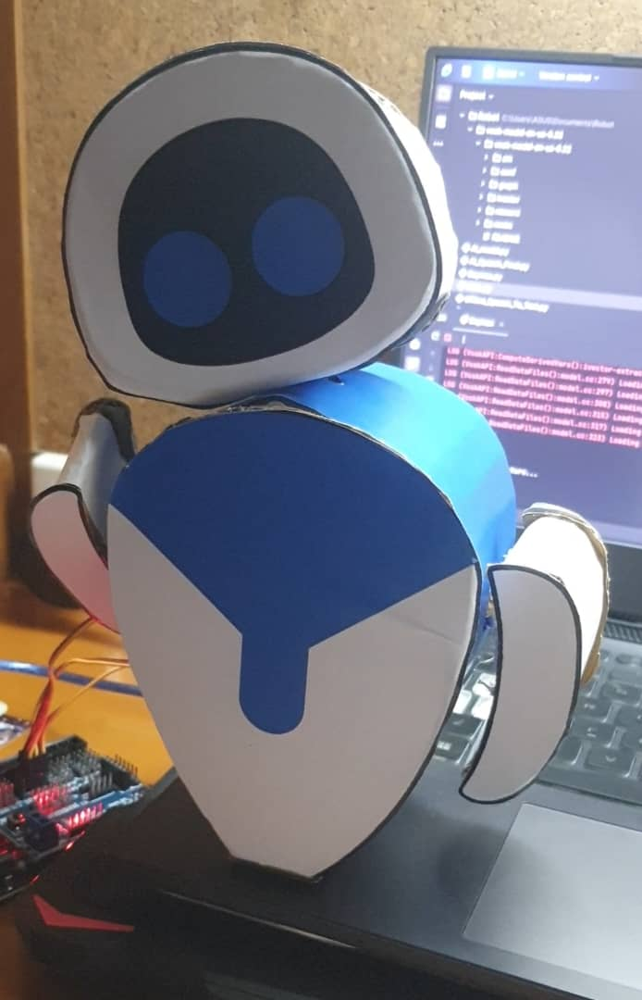

# MAX: Interactive Desktop Robot

## Project Overview
MAX is a custom-built, Wall-E-style interactive desktop robot designed to process natural language commands and respond with physical actions. This project demonstrates the seamless integration of offline voice processing, AI-driven decision-making logic, and localized electromechanical hardware control.

  *The assembled MAX desktop robot, featuring articulated servo-driven joints for expressive movement.*

Reference = "https://youtu.be/x0oUZ4HS7lg?si=6bdQm67jqX90B_nI"

## Implementation Details

### Speech Recognition & Intent Parsing
The "brain" of the robot is powered by a central **Python script**. For audio processing, the **Vosk library** was integrated to enable fast, offline speech recognition. This ensures the robot can process voice commands locally with zero latency, without relying on cloud-based APIs.

Once speech is converted to text, **Fuzzy Logic** algorithms are utilized for intent parsing. This allows the robot to intelligently interpret the user's meaning and determine the correct action, even with slight variations or imperfections in natural phrasing.

### Hardware Integration & Serial Control
Once the AI determines the correct intent, the Python script translates these commands into specific actuator instructions. These instructions are transmitted via **serial communication** to an onboard **Arduino microcontroller**. 

The Arduino parses the serial data and generates the precise PWM signals required to drive the **servo motors**, articulating the robot's physical responses in real-time.

## Hardware Demonstration

*(Watch MAX in action below)*

<video src="Max_robot.mp4" width="800" controls></video>

---
*Note: The core Python scripts and Arduino firmware are kept private, but are available for review upon request.*
